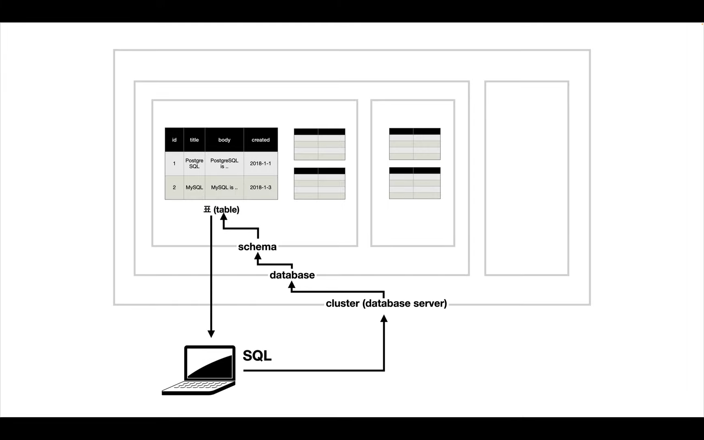
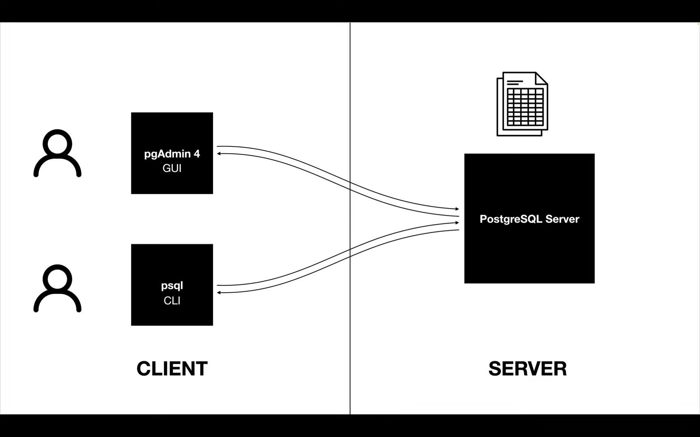

# 과제1: PostgreSQL 입문 수업

## 강의 정리

### 데이터베이스 구조 이해

관계형 데이터는 표(==`테이블`)에 저장된다.  
하나의 앱에는 여러 개의 테이블이 필요하다.  
연관된 테이블을 그룹핑한 것을 `스키마`라고 한다.  
스키마를 모아둔 것이 `데이터베이스`이다.  
하나의 컴퓨터에는 여러 개의 DB가 있다. 이것을 모아둔 것이 `클러스터(혹은 DB 서버)`이다.  

클러스터가 DB의 실체이다. 클라이언트는 이것과 통신한다.  
사용자(클라이언트)는 SQL 언어를 통해 클러스터 → 데이터베이스 → 스키마 → 테이블로 요청을 보낸다.  
서버는 요청한 작업을 처리한 후, 결과를 클라이언트에게 응답한다.

### postgreSQL 이해

데이터는 postgreSQL 서버에 저장, 보관, 관리 되고 있다.  
사용자는 이 데이터에 직접 접근할 수 없고, pgAdmin과 psql이라는 인터페이스를 통해서 접근할 수 있다.  
pgAdmin은 GUI, psql은 CLI이다.  

### pgAdmin 디렉토리 구조
- Server
    - Cluster (e.g. MyPG)
        - Databases
            - Maintenance Database: 기본으로 생성되는 데이터베이스 (e.g. postgres)
                - Schema: 테이블을 모아둔 그룹
                    - public: 기본으로 생성되는 스키마
                        - Tables: 해당 스키마가 갖고 있는 테이블
                            - A Table
                            - B Table
                            - ...
            - Other Database: 이후 개별적으로 생성한 데이터베이스 (e.g. opentutorials)
                - ...
        - Roles: 유저
            - 생성 시 Username으로 등록한 유저가 슈퍼 관리자

## 실습: SQL
### 데이터 생성(Create): `INSERT INTO ... VALUES ...`
- `INSERT INTO topic (title, body) VALUES('Select', 'Select is ...');`

### 데이터 조회(Read): `SELECT ... FROM ...`
- `SELECT * FROM topic;`
- `SELECT id, title FROM topic`
- `SELECT id, title FROM topic WHERE id > 1 ORDER BY id DESC LIMIT 1;`

### 데이터 수정(Update): `UPDATE ... SET ... WHERE ...`
- `UPDATE topic SET title = 'Delete', body = 'Delete is ...' WHERE id = 2;`

### 데이터 삭제(Delete): `DELETE FROM ... WHERE ...`
- `DELETE FROM topic WHERE id = 2;`